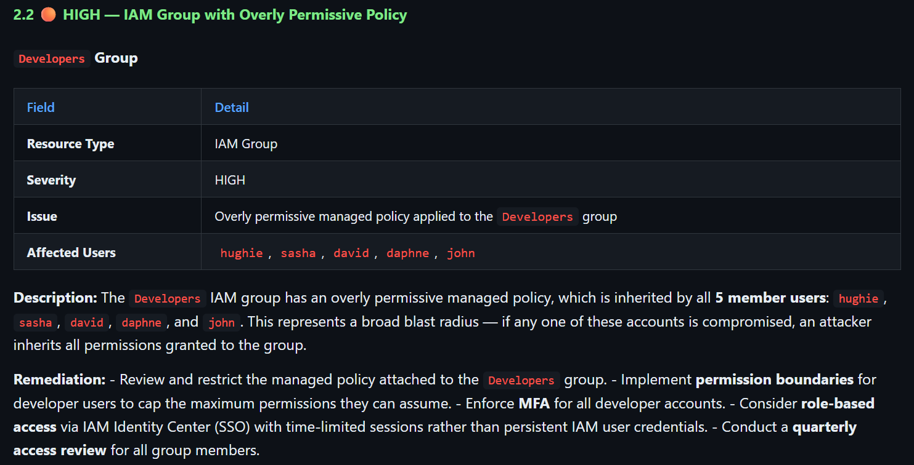

# AI-Powered Cloud Misconfiguration Scanner

## Overview

This AI-powered scanner identifies misconfigurations or abnormalities in the media organisation’s cloud infrastructure that would potentially give attackers/hackers/cyber criminals an advantage to access intellectual property and unreleased content, which could potentially be exploited and leaked to the public.

## The Problem

The security challenges the media and entertainment sectors currently face include the leakage of unreleased content, piracy, and supply chain disruptions. 

Studios and networks possess highly valuable, unreleased media (scripts, unedited footage, VFX files, unreleased episodes/movies). If these assets get leaked, this can potentially ruin huge global marketing campaigns, dwindle box-office numbers, and lose millions in revenue. 

Media production and broadcasting require collaboration with third-party vendors, where work, ranging from scripts to post-production and VFX, is outsourced. These vendors may have smaller cyber budgets and weaker security infrastructures, which would give hackers the advantage to exploit those weaknesses to infiltrate production networks. The VFX studio, for instance, may be breached to steal episodes, or at least the information about these episodes, of a major studio’s unreleased series.

For example, think of a new season of Daredevil: Born Again. What happens if every episode, or even what happens in the episode, gets leaked before or during release? This could cost Disney+ new/current subscribers, as people are watching the pirated version via other means rather than directly on the platform. This would prevent Disney+ from generating revenue, leading to the show getting cancelled instead of getting renewed for a new season.

Broadcasters are heavily dependent on time-sensitive, IP-based remote workflows. Live events require zero margin of error for instantaneous processing. If an attack such as a DDoS or signal hijacking occurs during a live broadcast, this can cause loss of audience retention, irreparable brand damage, and heavy losses in real-time advertising revenue. 

## How It Works

- This AI-powered cloud misconfiguration scanner connects to AWS and checks for misconfigurations among the existing resources, such as S3, IAM, EC2, and CloudTrail.
  - **S3 (Simple Storage Service)**:
    - The S3 bucket is a Simple Storage Service, and this is where the files live. These files can be scripts, unedited footage, finished projects etc.
    - The S3 bucket, for example, is a vault/storage room where the important files are stored.
    - If the public knows where this vault/storage room is, then they would potentially come to the place and find ways to enter the room to obtain the files.
    - If the vault/storage room has no locks or security guards surrounding it, this would give attackers the opportunity to enter the room to access the files.
    - The cloud scanner’s role, in this situation, is to ensure that the location of the vault/storage room is not exposed to the public and that the vault is fully locked and secure.
   
  - **IAM (Identity and Access Management)**:
    - The IAM roles and policies control who is allowed to do certain tasks based on the permissions they have.
    - This can be which people, accounts, or services can read a file, delete a server, change settings etc.
    - For example, the IAM permissions are a set of keys that a person has to access certain rooms in a building. Each key represents a permission. If the person has way too many keys, including ones that grant access to rooms that contain critical information, the chances of those particular keys ending up in the wrong hands are high, especially if the key set has been misplaced, lost or stolen.
    - For instance, the person with a stolen keyset has access to a room where new keys are cut. The person could make a new copy of the master key once they are inside this particular room. With the copied master key, they have access to every single room.
    - The person could potentially enter rooms that aren’t part of the original target. Once inside, they could steal or tamper with the assets stored in the room.
    - In this particular scenario, the inspector/auditor in the building acts as the scanner, and their job is to ensure each individual only has the necessary set of keys required to fulfil their respective roles. Any unnecessary keys an individual holds will be flagged for further review and action.

  - **EC2 (Elastic Compute Cloud)**:
    - EC2 instances are the virtual servers/machines running in the cloud.
    - The EC2 is where the user does the actual work, such as editing content, rendering the VFX, hosting the applications to carry out the tasks etc.
    - For example, the EC2 instance is the editing room in the building where VFX artists uses licensed software like Adobe Premiere to edit footage.
    - The editing room and its entrance are right by a busy high street instead of being located deep inside the building.
    - This means that members of the public can easily see where the editing room is and deduce what goes on inside, and just like with the vault/storage room, they could simply try out the handle to see what's inside.
    - The scanner’s role, in this scenario, is to ensure that the location of the editing room is not visible to the public eye and is only located somewhere a bit more discreet in the building.

  - **CloudTrail**:
    - This is a logging/record-keeping system that keeps track of who did what and when across the cloud environment.
    - The cloud scanner checks if CloudTrail is enabled, and it is logging any activities.
    - For example, a person enters the building, and there are checkpoints (eg, access-controlled doors with RFID or biometric readers) across several parts of the building where the person is required to log their name and time to access rooms further into the building. Each of the rooms and corridors has CCTV cameras in every corner for safety purposes.
    - If an incident occurs in any part of the building, it would be easier to trace the root cause as long as the checkpoints record the access data and the CCTV cameras are actively recording the footage.
    - Without checkpoints and CCTV cameras, it would be difficult to determine the root cause of the incident.

- The findings are sent to Claude to generate a report, where the findings are summarised clearly and are easy to read.

## What It Scans
This scanner checks for the following misconfigurations in the following AWS resources:

| Resources | What It Scans |
|---|---|
| S3 | Is it exposed to the public, and is it encrypted in a secure way? |
| IAM | Does the user/usergroup/role have full, unrestricted access to everything in the account? |
| EC2 | Is the EC2 firewall (security group) open to the public? |
| CloudTrail | Are there any existing trails, and do they record information on who did what and when across the cloud environment? |

## Tech Stack

| Technologies/Tools | Description |
|--------------------|-------------|
| AWS                | S3, CloudTrail, EC2, IAM |
| Terraform          | To establish resources in the AWS environment |
| Python | Creates a session with the AWS account using `boto3` and `botocore` so that it runs audit checks on S3, IAM, EC2, and CloudTrail. The findings for each resource are displayed in the terminal. |
| Claude API | The API is used to establish a connection between Python and Claude so that the findings are sent to the latter to generate a report that summarises the findings and recommendations and is easier to read. |

## How To Run It

### Install The Repository To Your Local Machine
- Clone this repository to your local machine:
  ```
  git clone https://github.com/<your-username>/AI-Cloud-Misconfiguration-Scanner.git
  ```

### Set Up AWS Account And IAM Account For Terraform Deployment
- Create an AWS root account
- Once this is created, in the AWS Console, go to **IAM → Users → Create user**
- On the permissions screen, attach **AdministratorAccess** directly
- Once created, go to the **user → Security credentials tab → Create access key**
- Select **Command Line Interface (CLI)** as the use case
- Copy the **Access Key ID** and **Secret Access Key**
- In the Bash terminal, run:
  `aws configure`
  You will be prompted to enter the following:
  ```
  AWS Access Key ID:      <paste your key>
  AWS Secret Access Key:  <paste your secret>
  Default region name:    <your region> #eg. eu-west-2
  Default output format:  json
  ```
- To verify it's working, run:
  `aws sts get-caller-identity`

### **Use Terraform To Create An AI Scanner User Account With Attached Permission Policies**

* In the terminal, change the directory to `terraform`:  
  `cd terraform`  
* To create the AI scanner user account (`ai_scanner_user`)  with its attached permission policies using Terraform, run:  
  ```  
  terraform init  
  terraform plan  
  terraform apply  
  ```  
* Create the access key and secret access key for the `ai_scanner_user` account via AWS CLI:  
  `aws iam create-access-key --user-name ai_scanner_user`  
* Copy the `AccessKeyId` and `SecretAccessKey`  
* To create the scanner profile, run:   
  `aws configure --profile ai-scanner`   
* Enter the following when prompted:  
  ```  
  AWS Access Key ID:      <paste your key>  
  AWS Secret Access Key:  <paste your secret>  
  Default region name:    <your region> #eg. eu-west-2  
  Default output format:  json  
  ```  
* Create a `.env` file in the repository root and add the scanner profile in the file:  
  ```  
  AWS_PROFILE=ai-scanner  
  ```

### **Connect Claude To Python Using Claude API**

* To get the **Claude API** key, go to: [https://console.anthropic.com](http://console.anthropic.com)  
* Go to **API Keys** and click **Create Key**  
* Copy the key and add it to the `.env` file:  
  ```  
  ANTHROPIC_API_KEY=sk-ant-...  
  ```

### **Run The Scanner**

* Create and activate a Python virtual environment in the terminal:  
  ```  
  python3 -m venv .venv  
  source .venv/bin/activate  
  ```  
* Install a list of libraries and packages from the `requirements.txt` file:  
  ```  
  pip3 install -r requirements.txt  
  ```  
* Run the scanner:  
  ```  
  python -m scanner.main  
  ```

## Sample Output

### IAM Check

#### IAM User Group: Developers

**Scan Results (Before Mitigation):**




See `report_2026-07-10_01-35.html` for more information.

**Scan Results (After Mitigation):**


After removing `AdministratorAccess` policy from the `Developers` IAM user group, two inline policies were created, `DeveloperEC2ScopedAccess` and `DeveloperS3ScopedAccess`, and are now attached to this user group. After conducting another scan, the finding that is linked to the  Developers IAM group is no longer seen in the HTML report (see `report_2026-07-12_18-00.html#iam-findings` for more information), because the user group no longer has an over permissive policy. As a result, the IAM findings with `HIGH` severity levels dropped from 8 to 7 findings.

**Changed Fields Table**
| Field | Before | After |
|-------|--------|-------|
| **Attached Policy** | AdministratorAccess | DeveloperEC2ScopedAccess, DeveloperS3ScopedAccess |
| **Services Covered** | All AWS services | EC2 (`StartInstances`, `StopInstances`, `RebootInstances`), S3 (`ListBucket`, `GetObject`, `PutObject`) |
| **Destructive Actions Allowed**| Yes | No | 

## Robust Error Handling & Isolated Testing

While testing the S3 checks against a live AWS account, the scanner crashed with an `AttributeError` the moment it encountered a bucket with no Public Access Block configuration. Investigating the crash surfaced a deeper issue: the code was written to catch a named exception class (e.g. `client.exceptions.NoSuchPublicAccessBlockConfiguration`) that doesn't actually exist in this version of `botocore`. AWS documents `NoSuchPublicAccessBlockConfiguration` as an API error code, not an auto-generated Python exception class, so the `except` clause failed before it ever ran.

The fix was to catch the generic `botocore.exceptions.ClientError` and branch `on e.response['Error']['Code']` instead of relying on a specific exception name. This also surfaced a second, more subtle problem: the original code treated `AccessDenied` (the scanner lacking permission to check a setting) identically to a genuine misconfiguration (the setting being absent or permissive). Both produced the same "finding," even though these are fundamentally different situations. Conflating them would make the scanner's own permission gaps look like security findings on the target account.

The scanner now distinguishes between three outcomes per check:
- **A real finding**: the setting exists and is genuinely misconfigured, or is confirmed absent.
- **A warning**: the scanner was denied permission to check, which reflects the scanner's own IAM posture, not the target resource.
- **An unexpected error**: any other AWS error code, logged separately so it's never silently swallowed.

`findings` and `warnings` are now returned and reported separately, so a reader can immediately tell "this bucket is misconfigured" apart from "the scanner couldn't verify this".

### Testing without depending on live AWS state

Reliably triggering each of these code paths against a real AWS account isn't practical. For example, once the scanner's IAM permissions were corrected, it became impossible to naturally reproduce an `AccessDenied` response to verify that branch still worked. To test each outcome in isolation, the S3 check function is exercised against a mocked boto3 client using Python's `unittest.mock`, with `session.client` patched to return a controlled fake client whose methods raise specific, deliberately chosen `ClientError` codes.

This allows every branch, including genuine misconfiguration, access denied, and unexpected error, to be verified independently and repeatably, without needing to manufacture matching real world AWS states (which, in some cases, AWS's own default behavior makes deliberately difficult to reproduce).

## Lessons Learned: A Bug That Worked By Accident

Not every bug announces itself with a crash. While building isolated tests for the S3 checks above, a standalone test script unexpectedly authenticated as the wrong IAM identity: the original `terraform-bootstrap` account instead of the scoped down `ai_scanner_user` the scanner is meant to run as.

The root cause traced back to how the AWS profile name gets loaded. `session.py` reads the AWS profile from an environment variable (`AWS_PROFILE`) that's meant to be loaded from a `.env` file via `load_dotenv()`. However, `session.py` only imported that library; it never actually called it. The scanner had been working correctly anyway, purely as a side effect: `main.py` also imports `report.py`, which does call `load_dotenv()` at import time, and Python executes that import before `create_session()` ever runs. The environment variable was being populated as an unrelated side effect of an unrelated file, for an unrelated reason (loading a separate API key for report generation).

This meant correct behavior depended entirely on import order in one specific entry point. Any new script that imported `create_session()` directly, including the isolated test scripts built for this project, would silently authenticate as the wrong AWS identity, with no error or warning at all.

The fix was to move `load_dotenv()` into `session.py` itself, the file that actually depends on the environment variable, so correct behavior no longer depends on what else happens to be imported elsewhere in the program.
This class of bug is arguably more dangerous than a crash. A crash is loud and gets fixed immediately. A silent fallback to the wrong AWS identity could just as easily have gone unnoticed, and in a security tool specifically, authenticating as the wrong account (with different, possibly broader permissions) is a meaningful correctness issue in its own right, not just a code quality nitpick.


